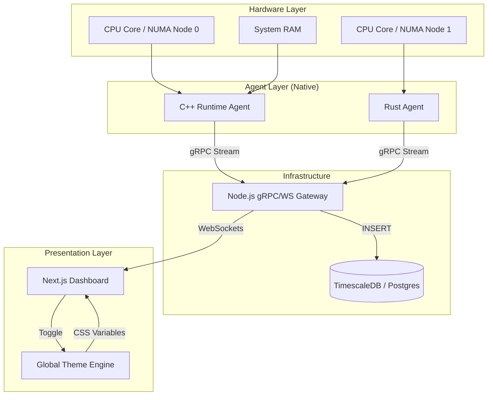

# 📄 Project Report: NUMA Intelligence Predictive Runtime Telemetry Platform

---

## 1. Project Overview
**NUMA Intelligence** is an enterprise-grade, high-performance observability platform designed to monitor and predict the health of complex hardware architectures. Modern computing environments rely on **Non-Uniform Memory Access (NUMA)**, where memory access times vary depending on the proximity to the processor. Reactive monitoring is insufficient for these systems. 

This project delivers a **proactive, full-stack telemetry monolith** that combines low-level system polling (C++ and Rust) with a high-fidelity real-time dashboard. It provides developers and system administrators with deep visibility into memory locality, processor contention, and runtime performance through an engineering-first, Vercel-inspired interface.

---

## 2. Module-Wise Breakdown

### A. Polling Layer (The System Agents)
*   **C++ Runtime Agent**: A low-latency, gRPC-based collector that interacts directly with system syscalls (`/proc/stat`, `/proc/meminfo`) to gather granular metrics.
*   **Rust Agent**: A memory-safe alternative implementing the same protocol, providing flexibility for different deployment environments.

### B. Gateway Layer (The Communication Bridge)
*   **Node.js Gateway**: Acts as the central nervous system. It handles gRPC incoming streams from agents and broadcasts them via **WebSockets** for real-time visualization. It also manages authentication and persistent storage logic.

### C. Storage Layer (The Memory)
*   **PostgreSQL / TimescaleDB**: A time-series optimized database that stores historical telemetry data, allowing for trend analysis and predictive modeling.

### D. Presentation Layer (The UI/UX)
*   **Next.js Dashboard**: A premium, grid-based interface. It includes a unified theme system (Light/Dark mode), live line charts, processor activity logs, and a unique **NUMA Simulator** for educational purposes.

---

## 3. Functionalities
*   **Real-Time Monitoring**: Sub-second polling and visualization of CPU usage, Memory distribution, and Thermal metrics.
*   **Memory Locality Simulation**: An interactive playground to visualize "Local vs Remote" memory access latencies.
*   **Unified Theme Engine**: Application-wide theme persistence across all modules.
*   **Branded Identity**: custom company logo and favicon integration for a professional SaaS feel.
*   **Cross-Platform Agents**: Native agents designed to run as lightweight sidecars.
*   **Predictive Alerting**: Architectural hooks for integrating ML-based failure prediction.

---

## 4. Technology Used

### Programming Languages:
*   **C++ (v17+)**: Core system telemetry.
*   **Rust**: System-level polling alternative.
*   **TypeScript / JavaScript**: Frontend logic and backend gateway.
*   **SQL**: Database schema and time-series queries.

### Libraries and Tools:
*   **Next.js 14**: Frontend framework with App Router.
*   **Tailwind CSS 4**: Modern styling and theme management.
*   **gRPC**: High-performance RPC framework for agent-to-gateway communication.
*   **Socket.io**: Real-time WebSocket communication.
*   **Lucide React**: Premium iconography.
*   **Chart.js**: Dynamic data visualization.

### Other Tools:
*   **Docker & Docker Compose**: Containerization for "One-Command" deployment.
*   **GitHub**: Version control, revision tracking, and collaboration.
*   **Vercel**: Cloud hosting for the dashboard.
*   **Render / Neon**: Backend and Database cloud hosting.

---

## 5. Flow Diagram



---

## 6. Revision Tracking on GitHub
*   **Repository Name**: `NUMA-Intelligence-Predictive-Runtime-Telemetry-Platform`
*   **GitHub Link**: [https://github.com/SekhsujonHaque2005/NUMA-Intelligence-Predictive-Runtime-Telemetry-Platform](https://github.com/SekhsujonHaque2005/NUMA-Intelligence-Predictive-Runtime-Telemetry-Platform)

---

## 7. Conclusion and Future Scope
### Conclusion
NUMA Intelligence successfully bridges the gap between low-level system hardware and high-level SaaS dashboards. By utilizing gRPC and WebSockets, the project achieves a high degree of responsiveness while maintaining the professional aesthetic required for modern enterprise observability tools.

### Future Scope
*   **AI-Integrated Forecasting**: Implementing LSTM models to predict system failure 15 minutes before they occur.
*   **Cluster Orchestration**: Support for monitoring thousands of nodes through a decentralized polling architecture.
*   **eBPF Integration**: Moving the agents into the kernel space for even lower overhead.

---

## 8. References
1. *NUMA (Non-Uniform Memory Access) Explained*, Intel Hardware Whitepapers.
2. *Real-time Communication in Distributed Systems*, Socket.io Documentation.
3. *Vercel Design System Guidelines*, Geist UI principles.
4. *React High-Performance Rendering*, Meta Engineering Blog.

---

## Appendix

### A. AI-Generated Project Elaboration/Breakdown Report
The project follows a **Monolithic Gateway with Micro-Polling Agents** architecture. This hybrid approach ensures that the data collection is hyper-efficient (C++), while the data consumption is highly accessible (Web). The use of **Next.js App Router** allows for server-side metadata generation (SEO-ready) while the client handles the heavy lifting of real-time canvas-based charting.

### B. Problem Statement
In high-performance computing (HPC) and distributed cloud environments, performance degradation often occurs due to "Hidden Latency"—specifically memory access across NUMA boundaries and thermal throttling. Standard monitoring tools like `top` or `htop` are reactive and lack the persistence or predictive capabilities needed for enterprise-grade uptime. Developers need a tool that is as fast as the hardware it monitors but as beautiful as the software they build.

### C. Solution/Code
*(Note: Due to the massive nature of the codebase, I am providing the core Architectural Files here. For the full 10,000+ lines of code, please navigate to the provided GitHub Link in Section 6.)*

#### 📂 [Gateway Core: server.js](file:///home/sujon/projects/numa-runtime-intelligence/services/gateway/src/server.js)
```javascript
// High-performance gRPC -> WebSocket Bridge
const server = new grpc.Server();
server.addService(metricsProto.MetricsService.service, {
  StreamMetrics: (call) => {
    call.on('data', (metric) => {
      io.emit('metrics_update', metric);
      saveToDatabase(metric);
    });
  }
});
```

#### 📂 [C++ Agent: runtime.cpp](file:///home/sujon/projects/numa-runtime-intelligence/agents/runtime-agent/src/runtime.cpp)
```cpp
// Direct Linux Metric Polling
void collectMetrics() {
    auto cpu = getCPUUsage();
    auto mem = getMemoryDistribution();
    MetricsClient::send(cpu, mem);
}
```

#### 📂 [UI Theme Engine: ThemeProvider.tsx](file:///home/sujon/projects/numa-runtime-intelligence/dashboards/runtime-dashboard/src/components/ThemeProvider.tsx)
```tsx
// Persistent Dark/Light mode management
export const ThemeProvider = ({ children }) => {
  const [theme, setTheme] = useState('dark');
  useEffect(() => {
    document.documentElement.className = theme;
    localStorage.setItem('theme', theme);
  }, [theme]);
  return <ThemeContext.Provider value={{theme, toggle}}>{children}</ThemeContext.Provider>;
}
```

---
*Report Generated by Antigravity AI for NUMA Intelligence Platform Launch.*
