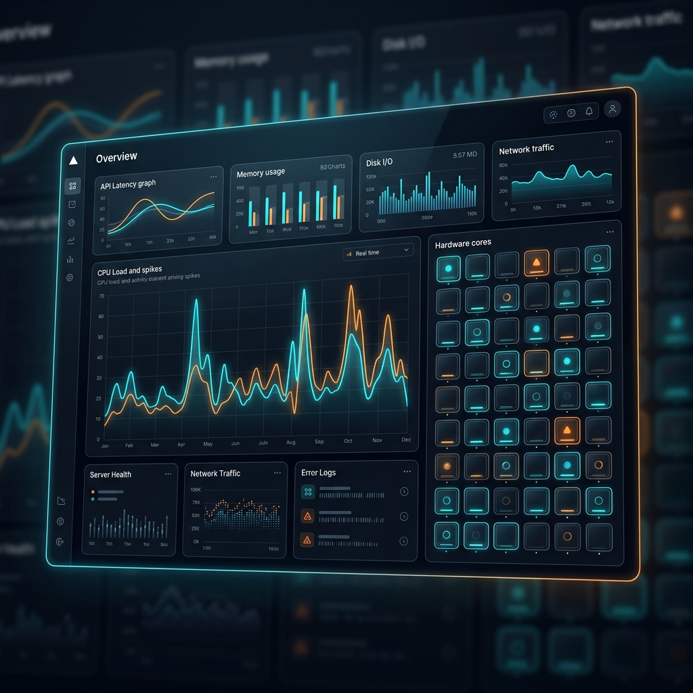
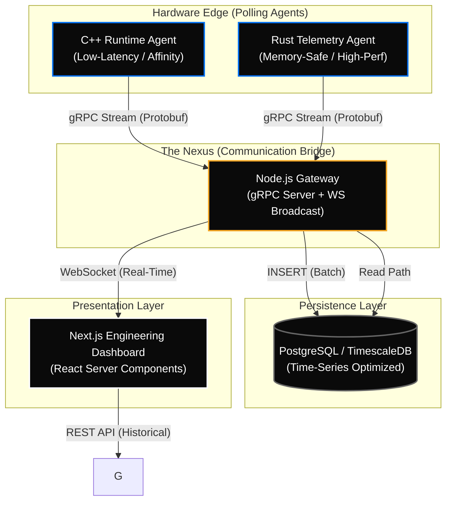

# ⚡️ NUMA Intelligence: Predictive Runtime & Telemetry Platform



<div align="center">


**An enterprise-grade, hardware-affirmative observability suite designed for high-performance NUMA architectures.**

[Demo Video](https://github.com/SekhsujonHaque2005/NUMA-Intelligence-Predictive-Runtime-Telemetry-Platform#) • [Documentation](docs/architecture.md) • [Project Report](PROJECT_REPORT.md)

</div>

---

## 🔥 Why This Matters

In the era of massive core counts, the bottleneck has shifted from raw compute to **Memory Locality**. Traditional monitoring tools treat all memory as equal, but in **Non-Uniform Memory Access (NUMA)** systems, accessing remote memory can be **3-5x slower** than local access.

**NUMA Intelligence** solves this "Hidden Latency" by:
- **Exposing Reality**: Visualizing per-core memory contention that `top` and `htop` miss.
- **Predictive Health**: Identifying thermal and workload patterns that precede hardware failure.
- **Hardware-Affirmative Design**: Providing developers the data they need to pin threads and optimize memory-aware applications.

---

## 🏗 High-Level Architecture

The platform operates as a coordinated ecosystem, bridging low-level system polling with high-fidelity React visualizations.



---

## 🛠 Tech Stack

| Layer | Technologies |
| :--- | :--- |
| **Edge Agents** |   |
| **Communication** |   |
| **Gateway** |   |
| **Database** |   |
| **Frontend** |   |

---

## 📡 Protocol Specifications

The system utilizes strongly-typed **Protocol Buffers** to ensure high-performance serialization across the polyglot stack.

```protobuf
service RuntimeService {
  // Bi-directional stream or unary rpc for metric ingestion
  rpc SendMetrics (Metrics) returns (MetricsReply) {}
}

message Metrics {
  string source = 1;     // e.g., "cpp-agent-01"
  int32 cpu_id = 2;      // Target CPU Core ID
  float cpu_usage = 3;   // Real-time workload percentage
}
```

---

## 🚀 Getting Started

### 1️⃣ Database Setup
Ensure PostgreSQL is running, then initialize the telemetry schema:
```bash
./setup_db.sh
```

### 2️⃣ Start The Gateway
The central bridge for all telemetry data:
```bash
cd services/gateway && npm start
```

### 3️⃣ Launch Polling Agents
Deploy your choice of agents (or both) to the target hardware:
- **Rust Agent**: `cd agents/rust-agent && cargo run`
- **C++ Agent**: `cd agents/runtime-agent/build && ./runtime_agent`

### 4️⃣ Open Dashboard
View real-time hardware intelligence:
```bash
cd dashboards/runtime-dashboard && npm run dev
```
Navigate to: `http://localhost:3000`

---

## ⚖️ License
Released under the [MIT License](LICENSE). Built for high-performance engineering teams.

---
<div align="center">
<b>© 2026 NUMA Intelligence Platform. Built for the Edge.</b>
</div>
