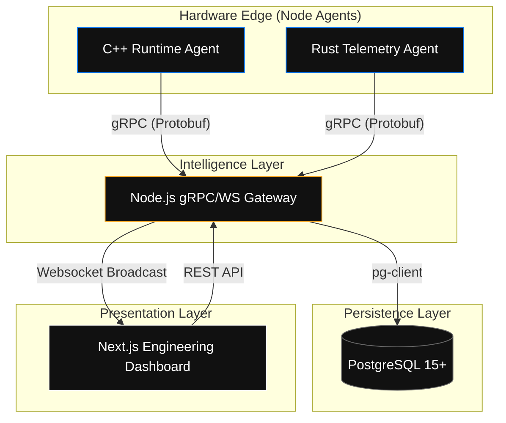

# NUMA Intelligence: Predictive Runtime & Telemetry Platform


## 📄 The Manifesto
Modern hardware is increasingly complex. As core counts rise, the distance between a processor and its memory—**NUMA distance**—becomes the primary bottleneck for high-performance applications. **NUMA Intelligence** is an enterprise-grade observability and optimization suite designed to abstract this complexity. 

By providing sub-millisecond telemetry and architectural awareness, the platform empowers engineers to build software that is "Hardware-Affirmative," ensuring data locality and maximum throughput.

---

## 🏗 High-Level Architecture

The platform operates as a distributed ecosystem of high-performance agents and a centralized intelligence gateway.



---

## 🛠 Prerequisites & Installation

### Hardware Requirements
- **OS**: Linux (Kernel 5.10+ recommended for advanced `sched` features).
- **Architecture**: x86_64 or ARM64 with NUMA support.
- **Dependencies**: `libnuma-dev`, `build-essential`, `cmake`, `protobuf-compiler`.

### 1. Database Initialization
The platform requires a PostgreSQL instance with a `metrics` table. Run the provided setup script:
```bash
./setup_db.sh
```
*Note: Ensure your `PGUSER` and `PGPASSWORD` environment variables are configured.*

### 2. Core Gateway Deployment
The gateway handles gRPC ingestion from agents and broadcasts live signals to the UI.
```bash
cd services/gateway
npm install
npm start
```
- **gRPC Port**: `50051`
- **Dashboard API/WS Port**: `3001`

### 3. High-Performance Agent Build
Agents should be deployed to every node you wish to monitor.

**C++ Agent (Predictive Runtime):**
```bash
cd agents/runtime-agent
mkdir build && cd build
cmake ..
make
./runtime_agent
```

**Rust Agent (System Telemetry):**
```bash
cd agents/rust-agent
cargo run --release
```

### 4. Engineering Dashboard
Launch the web-based visualization suit.
```bash
cd dashboards/runtime-dashboard
npm install
npm run dev
```

---

## 📡 Protocol Specifications

### gRPC Definitions (`runtime.proto`)
The strongly-typed contract between the hardware edge and the intelligence gateway.

```protobuf
syntax = "proto3";
package runtime;

service RuntimeService {
  rpc SendMetrics (Metrics) returns (MetricsReply) {}
}

message Metrics {
  string source = 1;     // e.g., "cpp", "rust"
  int32 cpu_id = 2;      // Target core identifier
  float cpu_usage = 3;   // Workload percentage (0-100)
}

message MetricsReply {
  string status = 1;     // ACK/NACK
}
```

---

## 🚀 Key Performance Features

### 1. NUMA-Aware Scheduling
The C++ agent implements explicit thread-to-core binding. By using `pthread_setaffinity_np` and `numa_run_on_node`, it minimizes cross-node traffic, which traditionally introduces significant cache latency.

### 2. Real-Time Broadcast Logic
Unlike traditional monitoring which relies on 1-minute polling intervals, NUMA Intelligence utilizes the **Push-Broadcast** model. 
- **Agents push** data the moment it is sampled.
- **Gateway broadcasts** via WebSockets immediately upon receipt.
- **Result**: Sub-100ms latency from hardware event to UI visualization.

### 3. Predictive "Heartbeat" Intervals
The system tracks the frequency of incoming packets and can predict potential node failures (heartbeat silence) before they impact high-level application availability.

---

## 🤝 Contributing
We welcome contributions to the agents and the visualization layer. Please ensure all C++ code follows the `LLVM` style and Rust code passes `clippy` checks.

---

## ⚖️ License & Ethics
This project is released under the **MIT License**. It is designed for transparent infrastructure monitoring. Access to CPU usage metrics should be handled in accordance with your organization's security and privacy policies.

---
**© 2026 NUMA Intelligence Platform. Built for the Edge.**
