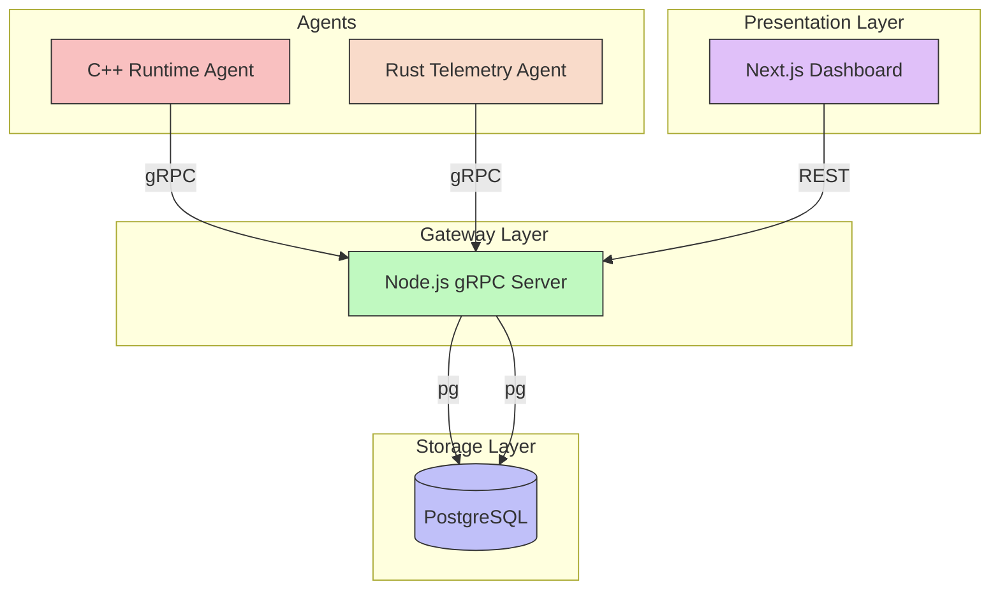

# NUMA Runtime Intelligence Architecture

This document describes the architecture of the real-time NUMA-aware telemetry system.

## High-Level Architecture

The system consists of the following components:

## Data Flow

1. **Telemetry Collection**: The C++ and Rust agents run directly on the host machine. The C++ agent uses `sched_setaffinity` to bind threads to specific CPU cores and collect NUMA-aware per-core metrics.
2. **Transportation**: The agents stream telemetry data `(source, cpu_id, cpu_usage, timestamp)` in real-time to the Node.js Gateway via high-performance gRPC streams.
3. **Ingestion & Storage**: The Node.js gRPC server receives the stream and continuously inserts the data into the PostgreSQL `metrics` table.
4. **API Layer**: The Node.js server also acts as an HTTP/REST API, querying PostgreSQL to serve real-time and historical data to the frontend.
5. **Visualization**: The Next.js dashboard polls the API to render live CPU usage charts and thread activity.

## Key Features

- **NUMA-Aware Scheduling**: Threads are explicitly pinned to CPU cores to prevent cache-misses and sub-optimal memory access across NUMA nodes.
- **CPU Affinity Fallback**: Graceful degradation if CPU affinity setting fails.
- **Microservices Design**: Clean separation between data collection (Agents), routing (Gateway), storage (DB), and presentation (Dashboard).
- **Protocol Buffers**: Strongly typed contracts (`runtime.proto`) between agents and the gateway.
